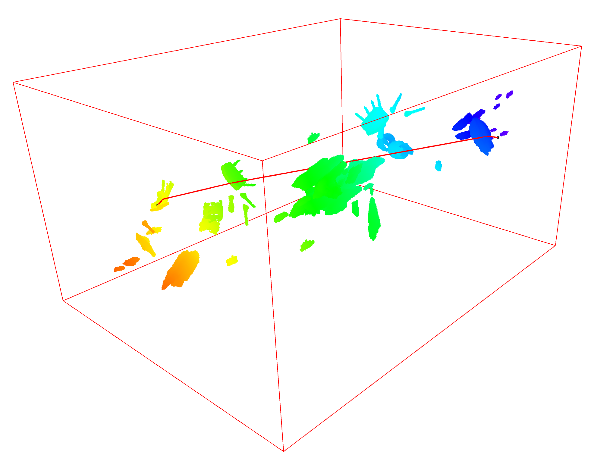
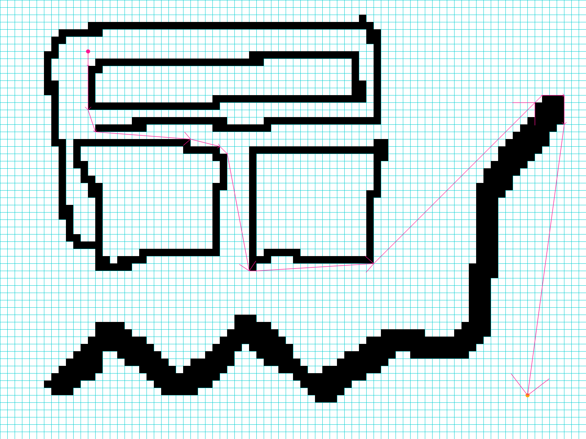
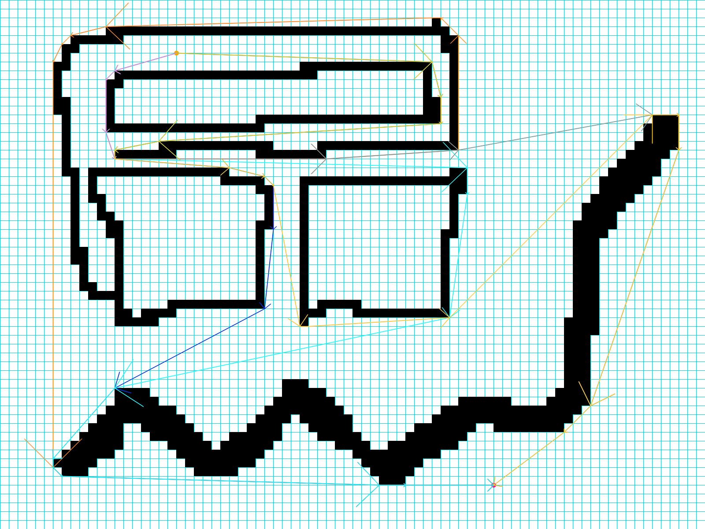

[GPF](free-nav.zip) is a General graph-based Path planning Framework. It has already been implemented for three classic problems and has achieved state-of-the-art performance. The dataset we use can be found [here](Grid-basedPathPlanningCompetitionDataset.zip).

##### 3D shortest path planning

##### 2D shortest path planning

##### 2D distinctive topology path planning
