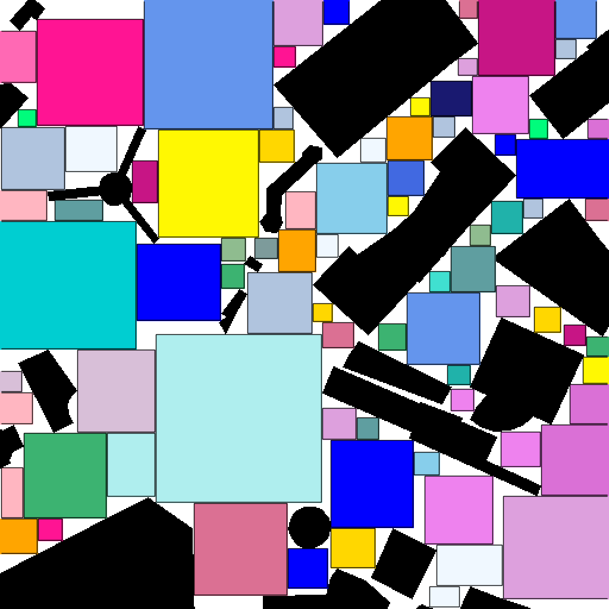

[JOB](LOS_with_jump_over_block.zip)(Jump Over Block) is a versatile approach designed to expedite line-of-sight (LOS) checks across maps of different dimensions. By significantly enhancing the efficiency of LOS calculations, this method optimizes the overall process of path planning or motion planning.

##### 3D block detection

##### 2D block detection
