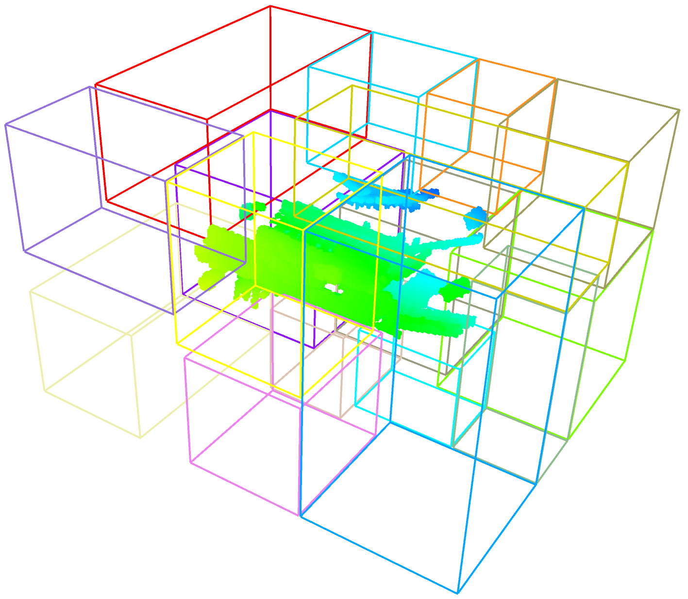

JumpOverBlock(JOB) is a versatile approach designed to expedite line-of-sight (LOS) checks across maps of different dimensions. By significantly enhancing the efficiency of LOS calculations, this method optimizes the overall process of path planning or motion planning. JOB split passable space into blocks, and jump over them during LOS check to accelerate LOS check. 

##### 3D block detection

##### 2D block detection

Source code: https://github.com/JoeYao-bit/JumpOverBlock

Map source: https://movingai.com/benchmarks/voxels.html