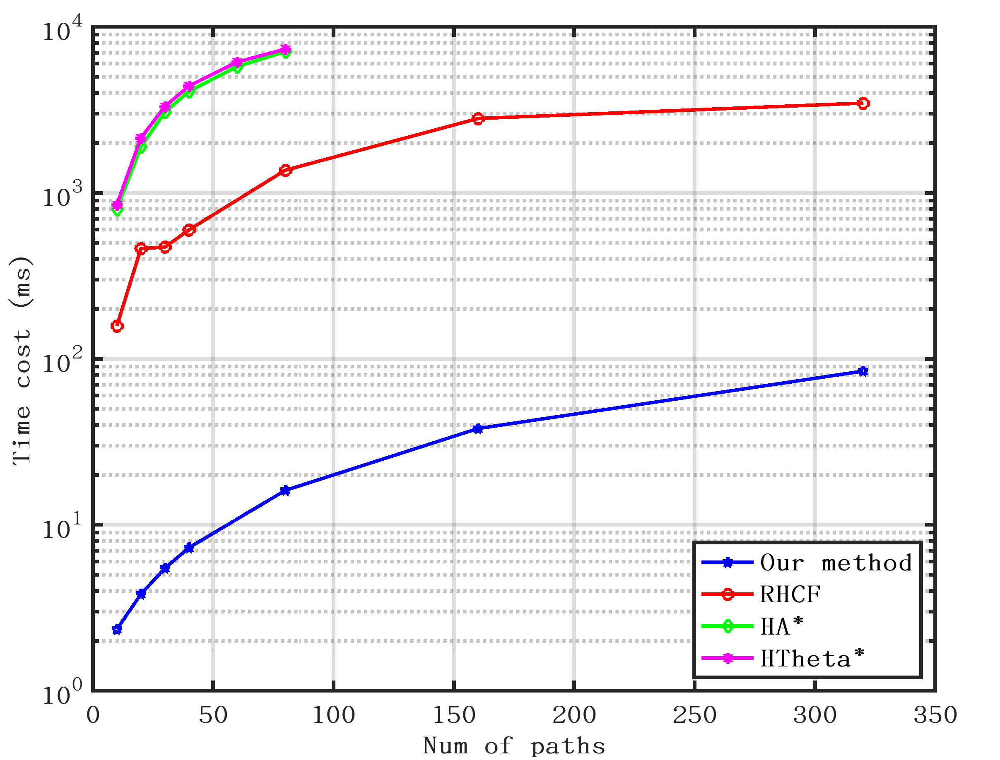
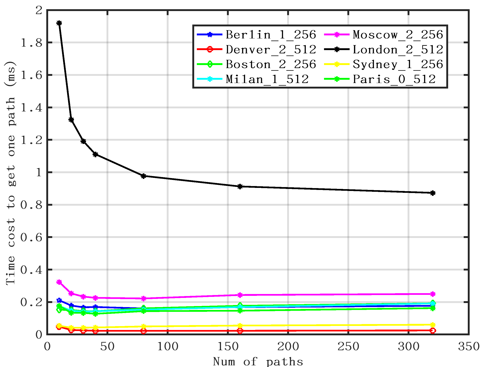

We proposed a tangent graph-based topologically distinctive path planning. It leverages the property that tangents form locally shortest paths, ensuring that any two locally shortest paths belong to different topologies.

Compared to existing algorithms, our approach requires no indicator to determine whether two paths belong to the same topology. Furthermore, it eliminates the need to repeat the search for multiple paths, as all distinctive paths can be found in a single search. 

And to address the challenge of the exponential growth in queue size during breadth-first search, we propose a priority limitation technique. This approach significantly reduces the time cost of searching for multiple paths while preserving computational complexity.

Comparison of total time cost to get multiple paths

Our method's mean time cost to get each path as number of paths increases

Source code: https://github.com/JoeYao-bit/TangentTopologyPathPlanning

Map source: https://movingai.com/benchmarks/grids.html