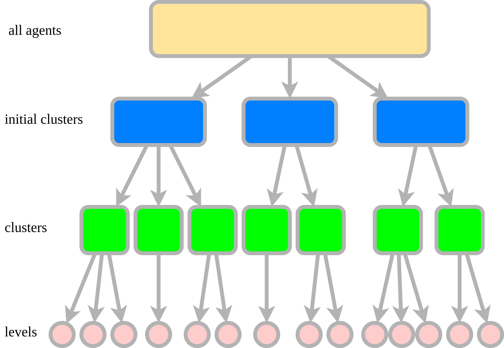

The computational and memory demands of multi-agent path finding (MAPF) escalate exponentially with the increasing number of agents. Consequently, many MAPF scenarios become intractable due to constraints in computational resources and memory, constraining the applicability of MAPF in intricate settings.

To address this challenge, we advocate a decomposition approach for MAPF instances. This method dissects instances involving numerous agents into several isolated subproblems with fewer agents. Additionally, we introduce a framework that empowers general MAPF algorithms to tackle each subproblem autonomously and amalgamate their solutions into a unified, conflict-free final solution, ensuring solvability. Unlike existing approaches that focus on isolated techniques to mitigate the time complexity of MAPF, our methodology is universally applicable to all MAPF methods.

In our experiments, we employ decomposition across various state-of-the-art MAPF methodologies using a well-established MAPF benchmark (Ihttps://movingai.com/benchmarks/mapf.html). On average, the decomposition of MAPF instances is achieved within 1 second. Moreover, its integration with seven MAPF methodologies markedly reduces memory usage or time complexity, particularly benefiting serial methodologies.

To foster further exploration within the research community, we have made the source code of our proposed algorithm publicly accessible.

Source code: https://github.com/JoeYao-bit/LayeredMAPF

##### Instance decomposition overview

